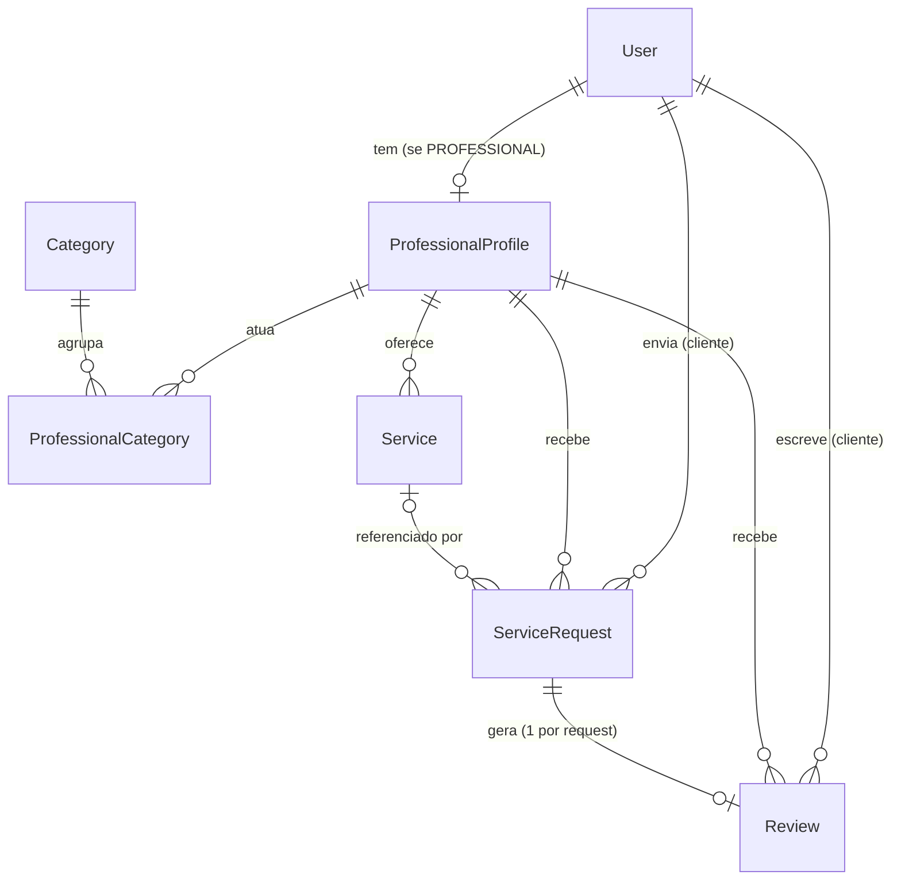

# 3. Banco de dados

[← Como rodar](./02-como-rodar.md) · [Índice](../README.md) · [Próxima: Padrões do código →](./04-padroes.md)

---

PostgreSQL acessado via **Prisma 7**. O schema fica em `prisma/schema.prisma`; a URL de conexão fica em `prisma.config.ts` (lida de `DATABASE_URL`).

## Diagrama



## Tabelas

Nos modelos os campos são camelCase; no banco, as tabelas e colunas são snake_case (via `@map`/`@@map`).

| Modelo | Tabela | Observações |
|---|---|---|
| `User` | `users` | `email` único; `role` = `CLIENT` \| `PROFESSIONAL`; `city` padrão "Coelho Neto"; senha só como `password_hash` |
| `ProfessionalProfile` | `professional_profiles` | Chave primária = `user_id` (1:1 com `User`) → o id do profissional é o id do usuário |
| `Category` | `categories` | `name` e `slug` únicos; lista fixa via seed |
| `ProfessionalCategory` | `professional_categories` | N:N profissional ↔ categoria (chave composta) |
| `Service` | `services` | `price_from` `DECIMAL(10,2)` opcional; `active` para pausar sem apagar |
| `ServiceRequest` | `service_requests` | `status` = `PENDING`/`ACCEPTED`/`DECLINED`/`COMPLETED`/`CANCELLED`; `service_id` opcional |
| `Review` | `reviews` | `request_id` único (1 avaliação por solicitação); `flagged` para denúncia |

### Campos desnormalizados (reputação)

Ficam em `ProfessionalProfile` para a busca não precisar recalcular tudo a cada consulta:

| Campo | Atualizado quando |
|---|---|
| `avg_rating`, `review_count` | Uma avaliação é criada |
| `response_rate` | Uma solicitação sai de `PENDING` (usa `service_requests.responded_at`) |
| `last_active_at` | O profissional realiza ações na plataforma |

*A lógica de atualização entra junto com os módulos de solicitações e avaliações.*

### Regras de exclusão

- Apagar um `User` apaga o `ProfessionalProfile` (cascade), e com ele categorias e serviços.
- Apagar um `Service` mantém as solicitações antigas (`service_id` vira `NULL`).
- Apagar uma `ServiceRequest` apaga a `Review` ligada a ela.
- Usuários com solicitações ou avaliações **não podem** ser apagados diretamente (restrição de FK) — preserva o histórico.

## Migrations

- Ficam em `prisma/migrations/` e **são versionadas** no Git.
- Mudou o `schema.prisma`? Rode `npm run db:migrate -- --name <descricao>` e commite a pasta gerada.
- Em produção, aplique com `npm run db:deploy` (ver [Deploy](./05-deploy.md#banco-em-produção)).

| Migration | Conteúdo |
|---|---|
| `20260922190842_init` | Criação de todas as tabelas, enums e índices |

## Seed

`prisma/seed.ts` insere as 17 categorias com `upsert` pelo `slug` — pode rodar várias vezes sem duplicar. O `slug` é o nome sem acentos, em minúsculas e com hífens (ex.: "Técnico de Informática" → `tecnico-de-informatica`).

## Prisma Client

- Gerado em `src/generated/prisma` (não versionado — rode `npm run db:generate` após clonar).
- Use sempre a instância única de `src/lib/prisma.ts`:
  ```ts
  import { prisma } from '../lib/prisma';
  ```
  Ela é reaproveitada entre recargas em dev e entre invocações na Vercel, evitando abrir conexões demais.
