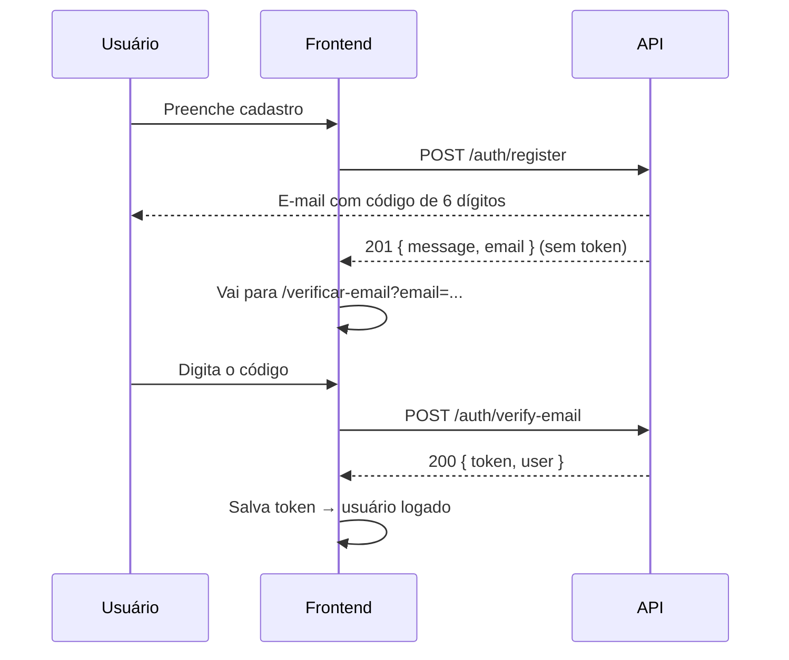

# 3. Integração

[← Telas](./02-telas.md) · [Índice](../README.md) · [Próxima: Modelos e endpoints →](./04-modelos-e-endpoints.md)

---

## Base URL e documentação

| Ambiente | Base da API | Swagger |
|---|---|---|
| Local | `http://localhost:3000/api/v1` | `http://localhost:3000/docs` |
| Produção | `https://<projeto>.vercel.app/api/v1` | `https://<projeto>.vercel.app/docs` |

- Health check: `GET /api/health` → `{ "status": "ok" }` (fora do `/v1`).
- Especificação OpenAPI 3.0: `/docs/openapi.json`. Dá para **gerar o client Angular automaticamente** (ex.: [`ng-openapi-gen`](https://github.com/cyclosproject/ng-openapi-gen) ou `openapi-generator` com `typescript-angular`), mantendo os tipos sempre em dia.
- Coloque a base URL em `environment.ts` / `environment.prod.ts`.

## Formato dos dados

- JSON com chaves em **camelCase**.
- IDs são **UUID** (string). Exceção: `Category.id` é número inteiro.
- Datas em **ISO 8601 UTC** (`"2026-09-22T19:08:42.000Z"`). Converta para o fuso local na exibição (`DatePipe`).
- Dinheiro (`priceFrom`) vem como **string decimal** (`"150.00"`) para não perder precisão — use `Number()`/`CurrencyPipe` com `'BRL'` na exibição. Pode ser `null` ("sob consulta").
- Campos opcionais vêm como `null` (não somem do JSON).
- Enums sempre em MAIÚSCULAS: `CLIENT`, `PROFESSIONAL`, `PENDING`, `ACCEPTED`...

## Paginação (todas as listas)

Query: `?page=1&pageSize=20` (padrão `page=1`, `pageSize=20`, máximo `50`).

```json
{
  "data": [ ... ],
  "meta": { "page": 1, "pageSize": 20, "total": 57, "totalPages": 3 }
}
```

## Formato de erro

Todo erro segue o mesmo formato:

```json
{
  "error": {
    "code": "VALIDATION_ERROR",
    "message": "Dados inválidos",
    "details": [
      { "field": "email", "message": "E-mail inválido" }
    ]
  }
}
```

`details` só aparece em erros de validação — use `field` para mostrar a mensagem embaixo do campo certo no formulário. As mensagens já vêm em português e podem ser exibidas direto.

| HTTP | `code` | Quando | O que o front faz |
|---|---|---|---|
| 400 | `VALIDATION_ERROR` | Campos inválidos | Mostrar erros por campo (`details`) |
| 400 | `INVALID_JSON` | Corpo malformado | Bug do front — logar |
| 400 | `INVALID_CODE` | Código de verificação errado, expirado ou tentativas esgotadas | Mostrar `message` + oferecer "Reenviar código" |
| 401 | `INVALID_CREDENTIALS` | E-mail ou senha incorretos no login | Mensagem no formulário de login |
| 401 | `UNAUTHORIZED` | Sem token, token inválido/expirado | Limpar sessão, ir para `/entrar?returnUrl=...` |
| 403 | `EMAIL_NOT_VERIFIED` | Login de quem ainda não confirmou o e-mail | Ir para a tela de verificação (ver abaixo) |
| 403 | `FORBIDDEN` | Logado, mas sem permissão (ex.: cliente tentando aceitar) | Mensagem "Você não pode fazer isso" |
| 404 | `NOT_FOUND` | Recurso/rota não existe | Tela/mensagem de não encontrado |
| 409 | `CONFLICT` | E-mail já cadastrado, avaliação já feita | Mensagem específica (`message`) |
| 409 | `INVALID_STATUS_TRANSITION` | Ação não permitida no status atual | Recarregar a solicitação e atualizar a tela |
| 429 | `TOO_MANY_REQUESTS` | Pedido de código repetido em menos de 60 s | Mostrar `message` ("Aguarde X segundos…") |
| 500 | `INTERNAL_ERROR` | Erro no servidor | Mensagem genérica |
| 502 | `EMAIL_SEND_FAILED` | Falha ao enviar o e-mail com o código | Mostrar `message` + botão "Reenviar código" |

> Dica: um `HttpInterceptor` de erro centraliza 401/403/500, e os formulários tratam 400/409 localmente.

## CORS

A API só aceita chamadas das origens configuradas no backend. Passe para o backend as URLs do front (ex.: `http://localhost:4200` e a URL de produção) para liberarmos.

---

## Autenticação ✅ implementada

JWT simples, **sem refresh token** na v1. O e-mail precisa ser **confirmado com um código de 6 dígitos** antes do primeiro login.

### Visão geral do fluxo



### 1. Cadastro

`POST /auth/register`

```json
{
  "name": "Maria Souza",
  "email": "maria@email.com",
  "password": "minhasenha123",
  "role": "CLIENT",
  "neighborhood": "Centro"
}
```

| Campo | Regra |
|---|---|
| `name` | 2 a 100 caracteres |
| `email` | E-mail válido (a API converte para minúsculas) |
| `password` | 8 a 72 caracteres |
| `role` | `"CLIENT"` ou `"PROFESSIONAL"` |
| `neighborhood` | Opcional, até 100 caracteres. `city` é sempre "Coelho Neto" |

Resposta `201` — **sem token**:

```json
{ "message": "Enviamos um código de verificação para o seu e-mail.", "email": "maria@email.com" }
```

→ Leve o usuário para a **tela de verificação**, passando o `email` retornado.

- Se o e-mail já estiver cadastrado **e verificado** → `409 CONFLICT` ("E-mail já cadastrado"). Ofereça "Entrar" ou "Esqueci minha senha" (futuro).
- Se já existir um cadastro **não verificado** com o mesmo e-mail, ele é **substituído** pelos dados novos e um novo código é enviado. Ou seja: quem errou algo no cadastro pode simplesmente se cadastrar de novo.
- Se `role = PROFESSIONAL`, o perfil profissional é criado vazio automaticamente → após verificar, **leve o profissional para completar o perfil** (`/painel/perfil`).

### 2. Verificação do e-mail

`POST /auth/verify-email`

```json
{ "email": "maria@email.com", "code": "482913" }
```

Resposta `200` — já **loga o usuário**:

```json
{
  "token": "eyJhbGciOi...",
  "user": { "id": "…", "name": "Maria Souza", "email": "maria@email.com", "role": "CLIENT", "city": "Coelho Neto", "neighborhood": "Centro", "createdAt": "…" }
}
```

Regras do código:

- **6 dígitos**, vale por **15 minutos**.
- Até **5 tentativas**; depois disso é preciso pedir outro código.
- Pedir um novo código invalida o anterior.
- Erro → `400 INVALID_CODE` ("Código inválido ou expirado. Solicite um novo código.").

### 3. Reenviar código

`POST /auth/resend-code` com `{ "email": "maria@email.com" }`

- Resposta `200` **sempre igual**, exista ou não o cadastro (por segurança).
- Intervalo mínimo de **60 segundos** entre envios → senão `429` com a mensagem "Aguarde X segundos…".
- Dica de UI: desabilite o botão "Reenviar código" com uma contagem regressiva de 60 s.

### 4. Login

`POST /auth/login` com `{ "email", "password" }` → `200 { token, user }` (mesmo formato da verificação).

| Resposta | Significado | O que fazer |
|---|---|---|
| `401 INVALID_CREDENTIALS` | E-mail ou senha incorretos (não diz qual) | Mensagem no formulário |
| `403 EMAIL_NOT_VERIFIED` | Senha certa, mas e-mail não confirmado | Chamar `POST /auth/resend-code` e ir para `/verificar-email?email=...` |

### Tela de verificação (sugestão)

- Rota `/verificar-email?email=maria@email.com`.
- Texto: "Enviamos um código para **maria@email.com**. Confira também a caixa de spam."
- Campo de 6 dígitos (`inputmode="numeric"`, `autocomplete="one-time-code"` — no celular o teclado numérico abre e alguns navegadores sugerem o código).
- Botão **Confirmar** + link **Reenviar código** (com contagem de 60 s) + link **Corrigir e-mail** (volta ao cadastro).

### Usando o token

- Envie em toda rota autenticada: `Authorization: Bearer <token>` (um `HttpInterceptor` resolve).
- Validade: **7 dias**. Expirou → a API responde `401 UNAUTHORIZED` → limpe a sessão e mande para o login.
- Guarde o token no `localStorage` (simples e suficiente para a v1).
- Não há endpoint de logout: sair = apagar o token no front.

### Guards sugeridos

- `authGuard` — exige estar logado (redireciona para `/entrar?returnUrl=<rota atual>`).
- `roleGuard('CLIENT' | 'PROFESSIONAL')` — exige o perfil certo.
- Ao iniciar o app com token salvo, chame `GET /me` para restaurar o usuário (e validar o token).

