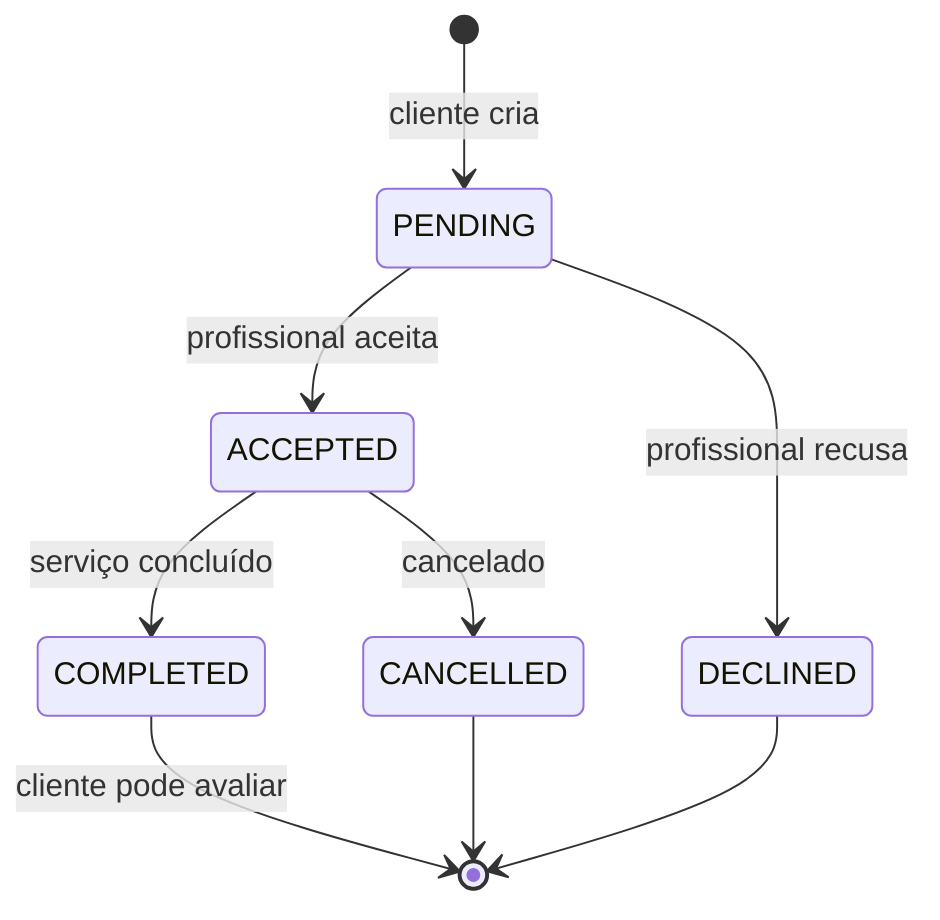

# 5. Regras de negócio

[← Modelos e endpoints](./04-modelos-e-endpoints.md) · [Índice](../README.md) · [Próxima: Design →](./06-design.md)

---

## Fluxo da solicitação de serviço

Qualquer outra transição é bloqueada pela API (`409 INVALID_STATUS_TRANSITION`).

### Labels e ações por status

Use a tabela para decidir **quais botões mostrar**. Mesmo assim, a API valida tudo — trate o 409 caso a tela esteja desatualizada.

| Status | Label sugerida | Cor | Cliente vê | Profissional vê |
|---|---|---|---|---|
| `PENDING` | Aguardando resposta | amarelo | — (aguardando) | **Aceitar** · **Recusar** |
| `ACCEPTED` | Aceita | azul | **Marcar como concluído** · **Cancelar** · WhatsApp | **Marcar como concluído** · **Cancelar** · WhatsApp |
| `DECLINED` | Recusada | cinza | — | — |
| `COMPLETED` | Concluída | verde | **Avaliar** (se ainda não avaliou) | Ver avaliação |
| `CANCELLED` | Cancelada | vermelho | — | — |

### Sugestões de UX

- Peça **confirmação** antes de Recusar, Cancelar e Concluir (são irreversíveis).
- No painel do profissional, destaque a contagem de `PENDING` — responder rápido melhora a taxa de resposta dele.
- Depois de concluir, abra direto o modal de avaliação para o cliente.

---

## Indicadores do profissional

Calculados pela API — o front só exibe.

| Campo | O que é | Como exibir |
|---|---|---|
| `avgRating` | Média das notas (1–5) | ★ 4.7 — se `reviewCount = 0`, mostre "Novo" / "Sem avaliações" em vez de 0 |
| `reviewCount` | Nº de avaliações | "(23 avaliações)" |
| `responseRate` | % de solicitações respondidas (aceitas ou recusadas) dentro do prazo, sobre o total recebido | "Responde 92% das solicitações" |
| `lastActiveAt` | Última atividade na plataforma | "Ativo hoje" / "ativo há 3 dias" |

## Ordenação da busca

A lista não é ordenada só pela nota. A API combina **nota + taxa de resposta + atividade recente**, para que perfis abandonados não fiquem no topo. O front apenas exibe na ordem recebida.

## Avaliações

- Só o **cliente** de uma solicitação **`COMPLETED`** pode avaliar.
- **Uma avaliação por solicitação** — após avaliar, esconda o botão (o campo `review` da solicitação passa a vir preenchido).
- Avaliação não pode ser editada nem apagada na v1.
- Qualquer usuário logado pode **denunciar** uma avaliação (ícone de bandeira discreto). A moderação é manual; a avaliação continua visível até ser analisada.

## Contato via WhatsApp

O contato final pode ser pelo WhatsApp, mas **a solicitação sempre nasce na plataforma** — é ela que gera histórico e permite a avaliação.

- Link: `https://wa.me/<whatsapp>?text=<mensagem codificada>`
  - ex.: `https://wa.me/5598999999999?text=${encodeURIComponent('Olá! Vi sua resposta no ConectaCN sobre a solicitação de instalação elétrica.')}`
- **Proposta:** o número do profissional só aparece **no detalhe de uma solicitação `ACCEPTED`/`COMPLETED`** (no perfil público `whatsapp` vem `null`). Isso incentiva o cliente a solicitar pela plataforma em vez de pular direto para o WhatsApp. (Ver [pendências](./07-roadmap.md#pontos-em-aberto).)
